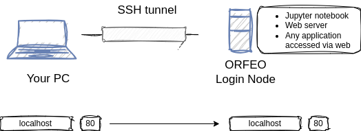
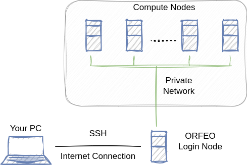

# SSH and Others

**SSH** (**S**ecure **S**hell) is a protocol used to remotely access machines.  
We will use it to connect to Orfeo and to your dedicated VMs. In general, SSH is the standard way to access Unix-based systems remotely.

---

## Password or Keys?

To log in to a remote machine, you can either use a **password** or a **public/private key pair**, depending on how the server is configured.  
Key pairs are usually preferred: they are more secure and avoid the need to share passwords.

---

## Generating a Key Pair

If you need access to a remote machine, you usually have to send your **public key** to the system administrator. You can generate a key pair with the `ssh-keygen` command:

```bash
ssh-keygen -t rsa -b 4096 -C 'your_email@example.com'
```

Example output:

```
Generating public/private rsa key pair.
Enter file in which to save the key (/home/vagrant/.ssh/id_rsa):
Enter passphrase (empty for no passphrase):
Enter same passphrase again:
Your identification has been saved in /home/vagrant/.ssh/id_rsa
Your public key has been saved in /home/vagrant/.ssh/id_rsa.pub
The key fingerprint is:
SHA256:/5K6wVVNXuLAWYl2UFMspKOVerqwKneuLV9q6naMA4w your_email@example.com
```

### Explanation of options

- `-t`  Type of key. Possible values: `rsa`, `ed25519`, `ecdsa`, etc.  
	Recommended: `rsa` or `ed25519`.
- `-b`  Key length (for `rsa` keys, use **4096**).
- `-C`  Adds a comment/label to the public key.
- **Passphrase**  Adds an extra layer of protection. If your private key is stolen, it cannot be used without the passphrase.
- **Location and name**  You can choose a custom path/filename. Using the default location (`~/.ssh/id_rsa`) is recommended for everyday use, since SSH automatically looks there.

---

## Accessing Generated Keys

If you used the default location, your key pair will be stored in the hidden `.ssh` directory inside your home folder.

Example:

```bash
vagrant@ubuntu2204:~/.ssh$ ls -la
total 20
drwx------ 2 vagrant vagrant 4096 Sep 21 13:28 .
drwxr-x--- 4 vagrant vagrant 4096 Sep 21 13:52 ..
-rw------- 1 vagrant vagrant  389 Sep 21 13:23 authorized_keys
-rw------- 1 vagrant vagrant 3389 Sep 21 13:28 id_rsa
-rw-r--r-- 1 vagrant vagrant  748 Sep 21 13:28 id_rsa.pub
```

- `id_rsa` your **private key** (keep it secret, only accessible by you).
- `id_rsa.pub` your **public key** (safe to share).
**Important:**
- Private key (`id_rsa`) must be readable **only** by you.    
- If permissions are too loose, SSH will refuse to use the key.

---

## First SSH Login to Orfeo

To log in for the first time:

```bash
ssh username@195.14.102.215
```

By default, SSH looks in `~/.ssh` for your private ksource mysuperenv/bin/activateey.

To specify a custom key:

```bash
ssh -i my_custom_key username@195.14.102.215
```

**Exercise:**

- Run with `-vvv` to see detailed logs of the SSH process.
- Generate a new key pair, try connecting using the wrong key, and observe what happens if the server doesn’t know your public key.
- Copy your correct key to a different location and connect using `-i`.
- Change the permission of your key and try to connect to Orfeo.

---

## Fingerprint

The first time that you connect to an host you have to accept its fingerprint. 

```bash
The authenticity of host 'x.x.x.x (x.x.x.x)' can't be established.
ED25519 key fingerprint is SHA256:l/+VX7zyl8asdfsadfeggerergergf0vqAB9w.
This key is not known by any other names.
Are you sure you want to continue connecting (yes/no/[fingerprint])?
```

If something in the remote host changes (OS, hostname, etc.), its fingerprint consequently changes. This is crucial for security reasons, as it helps avoid a man-in-the-middle attack. Checking the fingerprint is fundamental to preventing that.

The list of all fingerprints is usually stored in `.ssh/known_hosts`. If the fingerprint stored here and the one provided by the host do not match, SSH stops you from logging in.

If this is expected, for instance, after an update, you need to remove the old fingerprint and accept a new one. To do this, you can use the following command: `ssh-keygen -R <host-address>`.

**Exercise**: delete the ORFEO fingerprint, and accept a new one. Do it before deleting manually from `known_hosts`, repeat the exercise by using the command `ssh-keygen -R`.

---

## Configuring SSH

Typing your username, IP address, and key path every time is inconvenient. You can simplify this with an SSH configuration file.

Create/edit `~/.ssh/config`:

```
Host orfeo
  HostName 195.14.102.215
  User your_username
  IdentityFile /absolute/path/to/your_private_key
```

Now you can log in with:

```bash
ssh orfeo
```

**Exercise:** Set up your SSH config to simplify your login.

---

## Adding New Keys

When you connect via SSH, the server checks your **authorized keys** in `~/.ssh/authorized_keys` (on the remote machine).  
To allow another key, simply add its **public key** as a new line in that file.
**Exercise:**
- Generate a second key pair.
- Add the public key to your remote `authorized_keys` file on Orfeo.

**Warning:**  
Do not overwrite or delete your existing key in `authorized_keys`, or you might lock yourself out!

---
### Copy files

There are several ways to move files between machines using SSH. One simple tool is **Secure Copy** (`scp`). Its interface is almost the same as `cp`:

```bash
scp [options] [source] [destination]
```

Either `source`, `destination`, or both can be remote. Use the format `user@host:/path` for remote locations.

**Examples**

Copy a local file to Orfeo:
```bash
scp my_file username@195.14.102.215:/u/ipahome/yourusers/
```

Copy a whole directory (recursive):
```bash
scp -r my_folder username@195.14.102.215:/u/ipahome/yourusers/
```

Use a specific identity key:
```bash
scp -i /path/to/private_key my_file username@195.14.102.215:/u/ipahome/yourusers/
```

Use the `Host` alias from your `~/.ssh/config`:
```bash
scp my_file orfeo:/u/ipahome/yourusers/
```
**Useful options**
- `-r` : copy directories recursively.
- `-P <port>` : specify a nonstandard SSH port (note uppercase `-P` for `scp`).
- `-i <key>` : use a specific private key.
- `-p` : preserve modification times, access times, and modes.
- `-C` : enable compression (good for slow links).
-
**Tip:** For large syncs, bandwidth-efficient transfers, or resumable copies prefer `rsync -e ssh` (e.g. `rsync -avz -e "ssh -i /path/to/key" source/ user@host:/dest/`).

**Exercise**
1. Copy a file from your laptop to ORFEO.
2. Copy a file from ORFEO back to your laptop.
3. Copy a directory recursively with `-r`.
4. Try the same operations using the `orfeo` alias defined in your `~/.ssh/config`.

**Extra**: both source and destination can be remote, e.g.:
```bash
scp user1@hostA:/path/to/file user2@hostB:/path/to/destination
```

---

## Terminal Multiplexer `tmux`

Suppose you have a script that runs indefinitely on a remote machine:

```shell
sleep 12345
```

How do you keep its output accessible even after closing the shell or after a connection loss ? 
It's easy, use `tmux`:
1. Create a new session: `tmux new -s session_name`
2. Run your script.
3. Detach from the session: `Ctrl+b d`
4. List active sessions: `tmux ls`
5. Reattach to the session: `tmux attach -t session_name`
### Bonus features:

- Split the screen: `Ctrl+b "` or `Ctrl+b %`
- Close a panel: `Ctrl+b x`
- Scroll within a pane: `Ctrl+b [`
- Move with `Ctrl+b <arrows>`

**Exercise** Open a termina, launch `tmux` , split it in 4 quadrants, then move around .

### Share Your Terminal with Friends

```bash
tmux -S /tmp/shared_session_socket
chmod 777 /tmp/shared_session_socket
tmux server-access -a friend_username
```

Your friend can then join with:

```bash
tmux -S /tmp/shared_session_socket
```

**Note** this work in a shared machine, you can try this on ORFEO ! 

---
### Forwarding

SSH can forward ports so you can securely access services on a remote machine (or on your local machine) that are otherwise unreachable. There are two common types of forwarding:

1. **Local forwarding** (`-L`)  forward a local port to a remote address/port through the SSH server.
2. **Remote forwarding** (`-R`)  forward a remote port to a local address/port.

#### A little bit of theory

Every service on a network is identified by two things:

- An **IP address** (where the service is running)
- A **Port number** (which service to connect to on that machine, more than one service could be served on a single address!)
- 
A **web server** is simply a service that provides files (like HTML pages) over the network. You can run a web server on your own laptop, choose an IP address (such as `localhost`), and a port (for example `12345`).

Once it’s running, you can test it using 

- `curl` (from the command line)
- Your web browser.

Let’s set up a minimal example.

Write down `index.html` in a folder called `server`:
```html
<!DOCTYPE html>
<html lang="en">
<head>
    <meta charset="UTF-8">
    <title>My First Website</title>
</head>
<body>
    <h1>Hello, world!</h1>
    <p>This page is served by a Python web server.</p>
</body>
</html>
```
Go into `server` folder and start a python web server:

```bash
 python3 -m http.server -b 0.0.0.0 12345
```

Go to your browser and type: `localhost:12345`.
Check that it is working also with: `curl localhost:12345`.

Warning, using the brouwser could not work on WSL, let's discover together. 
#### Local forwarding (`-L`)

Forward remote service `localhost:8080` (on the remote machine) to your local port `8080`:

```bash
ssh -L 8080:localhost:8080 username@195.14.102.215
```



**Exercise**: on ORFEO start a webserver with python `python3 -m http.server <portnumber>` and try to access it from your local machine using the browser and using `wget`/`curl`.

Use `-N` to run SSH without an interactive shell (only forwarding) and `-f` to put it in the background:

```bash
ssh -f -N -L 5432:localhost:5432 username@195.14.102.215
```

**Exercise** once that you run this in background, test if it is working and then use `ps` and `kill` to terminate the process.
#### Remote forwarding (`-R`)

Forward a port on the remote server back to your local machine. Useful if you want the remote host (or people on it) to access a service running on your laptop.

Expose your local web server at `localhost:3000` to port `9000` on the remote host:

```bash
ssh -R 9000:localhost:3000 username@195.14.102.215
```

Now someone on the remote host can access `http://localhost:9000` and reach your local `3000`.

**Note**: Remote forwarding can be restricted by the server’s SSH configuration (`GatewayPorts`, `AllowTcpForwarding`).

**Exercise** start a local web server, as above, but in your machine, the check it correct functionality with `curl`/`wget` from ORFEO login node. 

**Advanced group exercise** : 
Work in pairs to practice remote and local port forwarding.
1. One student should start a local web server (or a jupyter notebook) on their laptop.
2. That student must then use **remote port forwarding** to expose the server through **ORFEO**.
3. The other student should set up **local port forwarding** so that requests from **ORFEO** are redirected to its own laptop.
---

### Practical example with forwarding - Jupyter notebook

The goal is to have a jupyter notebook up and running on a remote machine (we will exploit ORFEO login node). And connect using our browser.

**Tasks**:
- Connect to **ORFEO** 
- Create a python virtual environment `python3 -m venv myenvironment`. On the next lecture we will depict this command.
- Activate the virtual env `source myenvironment/bin/activate`
- Install jupyter lab `pip install jupyterlab`
- Start a notebook with `jupyter lab`
- Then a link should appear: 
  ```bash
     To access the server, open this file in a browser:
        ...
    Or copy and paste one of these URLs:
        http://localhost:8888/lab?token=d3a866986d6437731ca2d758a674da599d
        http://127.0.0.1:8888/lab?token=d3a866986d6437731ca2d758a674da599d  ```

This link will not work on your laptop ! 
You need to establish an SSH tunnel in order to reach port 8888 in the login node. 
**Exercise**: do it as exercise.


---

## SSH Jump Host (`-J`)

Sometimes, the machine you want to reach is **not directly accessible** from your local computer. It may be behind a firewall or only reachable from another machine (the **jump host** or **bastion host**).

SSH can **tunnel through an intermediate server** using the `-J` flag.

```bash
ssh -J your_username@10.128.2.171 your_username@195.14.102.215
```

- `your_username@195.14.102.215`  the jump/bastion server you can connect to directly.
- `your_username@10.128.2.171`  the final server you want to reach, in this case a compute node. 

SSH automatically connects to the jump host and then forwards traffic to the target host.





### Config file shortcut

You can simplify it in `~/.ssh/config`:

```text
Host compute_node
  HostName 10.128.2.171
  User your_username
  IdentityFile ~/.ssh/id_rsa
  ProxyJump orfeo
```

Now you can just run:

```bash
ssh compute_node
```

and SSH will automatically use the jump host.

